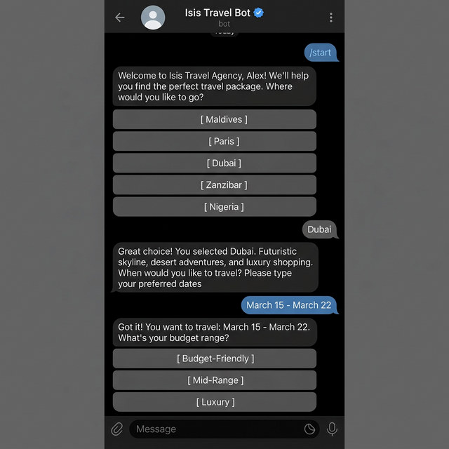

# Isis Travel Agency -- Telegram Bot

A Telegram chatbot built for a small travel agency that handles destination inquiries and package recommendations. Instead of answering the same questions over and over, the bot walks potential customers through the full booking flow -- from picking a destination to collecting contact details for follow-up.

Built with Node.js and the Telegram Bot API.

## Features

- **/start** -- Greets the user and presents available destinations as inline buttons
- **Destination selection** -- Users tap a button to choose from Maldives, Paris, Dubai, Zanzibar, or Nigeria
- **Travel date input** -- Prompts the user to type their preferred travel dates
- **Budget selection** -- Offers three tiers (budget, mid-range, luxury) as inline buttons
- **Package summary** -- Displays a formatted breakdown including destination, dates, duration, price, and what's included
- **Contact collection** -- Shows agency contact details and accepts the user's name and phone number for callback
- **Session management** -- Tracks each user's position in the conversation flow independently
- **Restart option** -- Users can start over at any point without losing context

## Demo



> Place a screenshot of the bot interaction as `bot-demo.png` in the project root.

## Tech Stack

- [Node.js](https://nodejs.org/)
- [node-telegram-bot-api](https://github.com/yagop/node-telegram-bot-api) -- Telegram Bot API wrapper
- [dotenv](https://github.com/motdotla/dotenv) -- Environment variable management

## How to Run Locally

### Prerequisites

- Node.js (v18 or higher recommended)
- A Telegram bot token

### Getting a Bot Token

1. Open Telegram and search for **@BotFather**
2. Send `/newbot` and follow the prompts to name your bot
3. BotFather will return a token that looks like `123456789:ABCdefGHIjklMNO`

### Setup

1. Clone the repository:

```bash
git clone https://github.com/btcbarbie/tg-chatbot.git
cd tg-chatbot
```

2. Install dependencies:

```bash
npm install
```

3. Create a `.env` file in the project root:

```
BOT_TOKEN=your_token_here
```

Replace `your_token_here` with the token from BotFather.

4. Start the bot:

```bash
npm start
```

The terminal should print a confirmation that the bot is running. Open Telegram, find your bot by its username, and send `/start`.

## Project Structure

```
tg-chatbot/
  bot.js           # Main bot logic, command handlers, session management
  package.json     # Project metadata and dependencies
  .env             # Bot token (not committed)
  .gitignore       # Excludes node_modules and .env
```

## License

ISC
